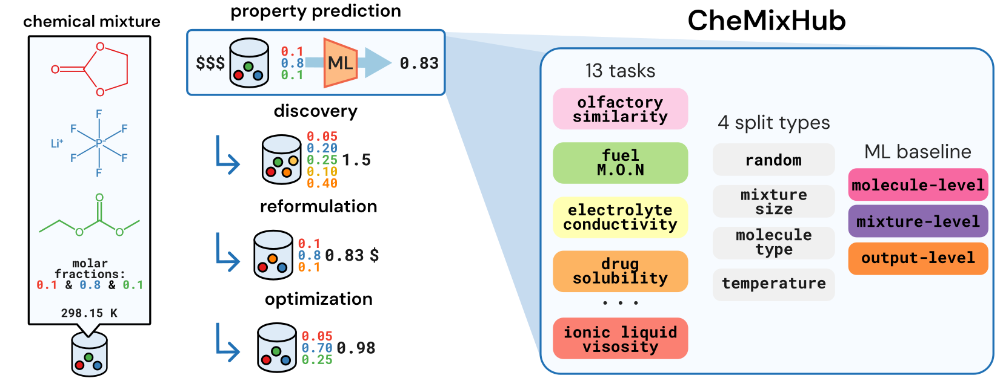

# 🧪📊 CheMixHub: Datasets and Benchmarks for Chemical Mixture Property Prediction

[](https://arxiv.org/abs/XXXX.XXXXX) <!-- TODO: Add ArXiv link -->
[](https://opensource.org/licenses/MIT) <!-- Or your chosen license -->



## 🚀 Overview

**CheMixHub** is the first comprehensive benchmark suite for machine learning on **chemical mixtures**. It provides curated datasets, robust data splitting strategies, and baseline models to accelerate research in predicting and optimizing mixture properties.

This repository contains all datasets, data processing scripts, and code for the baselines presented in our paper: _"CheMixHub: Datasets and Benchmarks for Chemical Mixture Property Prediction"_ (Link to paper/arXiv). <!-- Make this a link -->

## ✨ Features & Key Contributions

-   **🔬 Curated Datasets (13 Tasks):**
    -   Standardized 11 tasks from 7 diverse public datasets.
    -   **New:** 2 large-scale tasks (116,896 data points) from ILThermo, larger than any existing public mixture dataset.
    -   See [Dataset Details](#-dataset-details) below for a list of all included datasets and sources.
-   **🔄 Robust Generalization Splits:**
    -   Random
    -   Unseen Chemical Components
    -   Varying Mixture Size/Composition
    -   Out-of-Distribution Context (e.g., temperature)
-   **📈 Baseline Models & Benchmarks:**
    -   Implementations of representative ML models.
    -   Established initial performance benchmarks for easy comparison.
-   **🥐 [Croissant Metadata](https://www.nature.com/articles/s41597-024-03195-6):** Each dataset includes a `croissant.json` file, providing rich, standardized metadata for improved findability, usability, and interoperability with ML tools. (See `datasets/<dataset_name>/croissant.json`)

## 🏁 Getting Started

1.  **Clone the repository:**
    ```bash
    git clone https://github.com/chemcognition-lab/chemixhub.git # Corrected path
    cd chemixhub
    ```
2.  **Install dependencies:**
    ```bash
    pip install -e .
    ```
3.  **Explore the datasets:**
    -   Datasets are located in the `datasets/` directory. Each has a `README.md` with specific details.
    -   Processed data (`processed_data.csv` and `compounds.csv`) and data splits are in `datasets/<dataset_name>/processed_data/`.
4.  **(Optional) Run baseline models:**
    -   Scripts for training and evaluation are in `scripts/`. (See `scripts/README.md` for more details).

## 📁 Repository Structure

-   `datasets/`: Contains all curated datasets.
    -   `<dataset_name>/`:
        -   `README.md`: Dataset-specific information, license, and original source.
        -   `croissant.json`: Standardized metadata file.
        -   `raw_data/`: Original data files.
        -   `processed_data/`:
            -   `data_processing.py`: Script for standardization.
            -   `processed_data.csv`: Mixture-level data.
            -   `compounds.csv`: Component metadata.
            -   `{dataset_name}_splits/`: Predefined 5-fold CV splits.
-   `scripts/`: Utility scripts (training, evaluation, feature precomputation, etc.).
-   `chemixhub/`: Core library code (if applicable, for data loading, models, etc.). <!-- Add if you have a Python package structure -->

## 📊 Dataset Details

CheMixHub consolidates and standardizes data from the following sources:

-   **Miscible Solvents:** Density, enthalpy of mixing, partial molar enthalpy.
    [Source Paper](https://chemrxiv.org/engage/chemrxiv/article-details/677d54c86dde43c908a14a6c)
-   **ILThermo:** Transport properties (ionic conductivity, viscosity) for ionic liquid mixtures.
    [Source Paper](https://ilthermo.boulder.nist.gov/) | _Includes 2 new large-scale tasks._ | To get the dataset, run the following script: ``datasets/ionic-liquids/raw_data/fetch_ilthermo.py``
-   **NIST Viscosity:** Viscosity for organic mixtures from NIST ThermoData Engine (via Zenodo).
    [Source Paper](https://doi.org/10.1016/j.cej.2023.142454)
    | [Link to Dataset](https://zenodo.org/records/8042966) |
    Path to data file in Zenodo: ``nist_dippr_source/NIST_Visc_Data.csv`` | Download and put the file in ``datasets/nist-logV/raw_data`` and to get the processed dataset, run the following script: ``datasets/nist-logV/processed_data/data_processing.py``
-   **Drug Solubility:** Drug solubility in solvent mixtures.
    [Source Paper](https://jcheminf.biomedcentral.com/articles/10.1186/s13321-024-00911-3)
-   **Solid Polymer Electrolyte Ionic Conductivity (SPEs):** Ionic conductivity for polymer–salt mixtures.
    [Source Paper](https://pubs.acs.org/doi/10.1021/acscentsci.2c01123)
-   **Olfactory Similarity:** Perceptual similarity scores for mixtures.
    [Source Paper](https://arxiv.org/abs/2501.16271)
-   **Motor Octane Number (MON):** Octane numbers for hydrocarbons and fuels.
    [Source Paper](https://www.nature.com/articles/s42004-022-00722-3)

## Citing CheMixHub

If you use CheMixHub in your research, please cite our paper:

```bibtex
@article{chemixhub202X,
  title={{CheMixHub: Datasets and Benchmarks for Chemical Mixture Property Prediction}},
  author={}, % TODO
  journal={}, % TODO
  year={2025},
}
